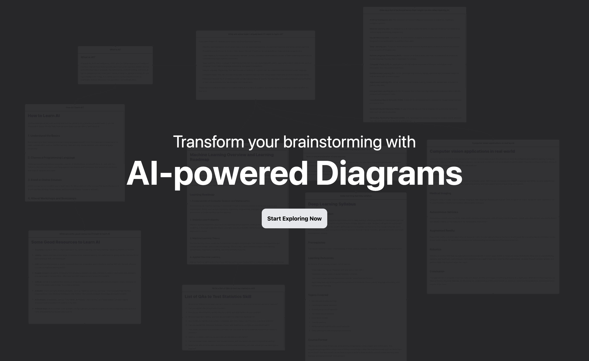
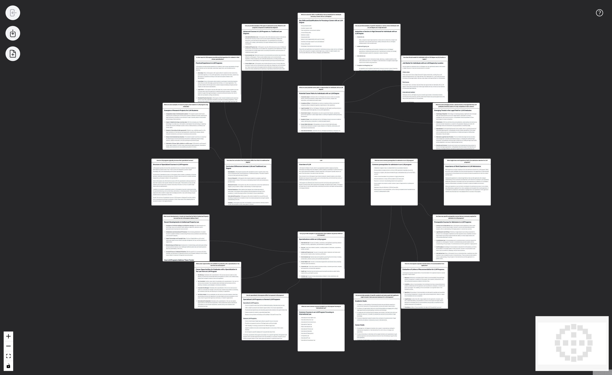

# AI Knowledge Graph

**A Graph interface to explore any topic using AI.**
Have you ever wanted to explore a topic in depth, but didn't know where to start?
AI Knowledge Graph is a tool that uses AI to help you ask the rigtht questions and help you explore using a whiteboard interface.

Visit [AIKnowledgeMap.com](https://aiknowledgemap.com) to try it out.




## Run locally 

First, run the development server:

```bash
npm run dev
# or
yarn dev
# or
pnpm dev
```

Open [http://localhost:3000](http://localhost:3000) with your browser to see the result.
